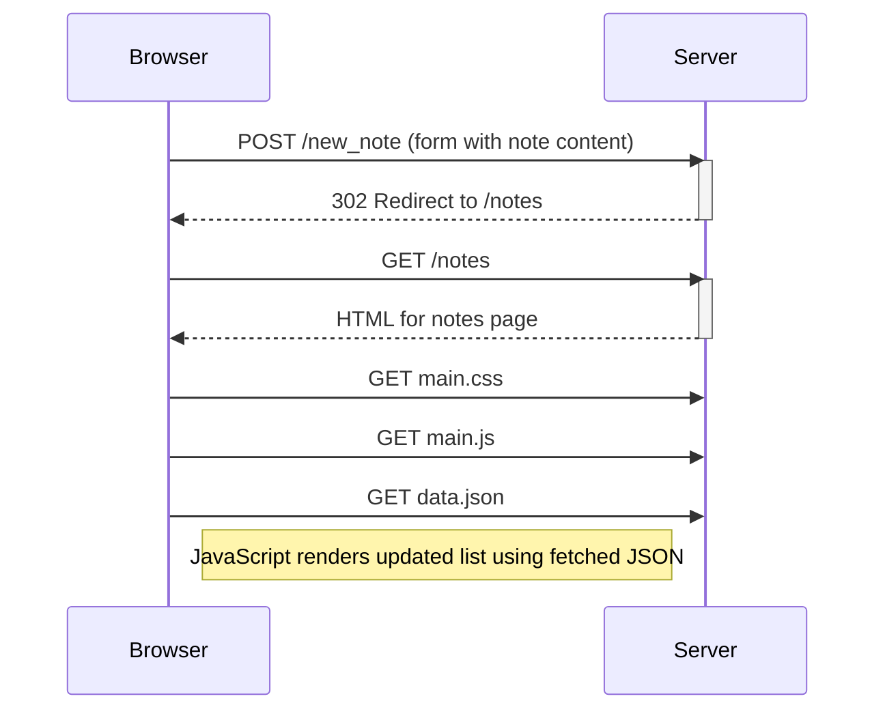

```mermaid
sequenceDiagram
    participant Browser
    participant Server

    Browser->>Server: POST /new_note (form with note content)
    activate Server
    Server-->>Browser: 302 Redirect to /notes
    deactivate Server

    Browser->>Server: GET /notes
    activate Server
    Server-->>Browser: HTML for notes page
    deactivate Server

    Browser->>Server: GET main.css
    Browser->>Server: GET main.js
    Browser->>Server: GET data.json
    Note right of Browser: JavaScript renders updated list using fetched JSON
```
