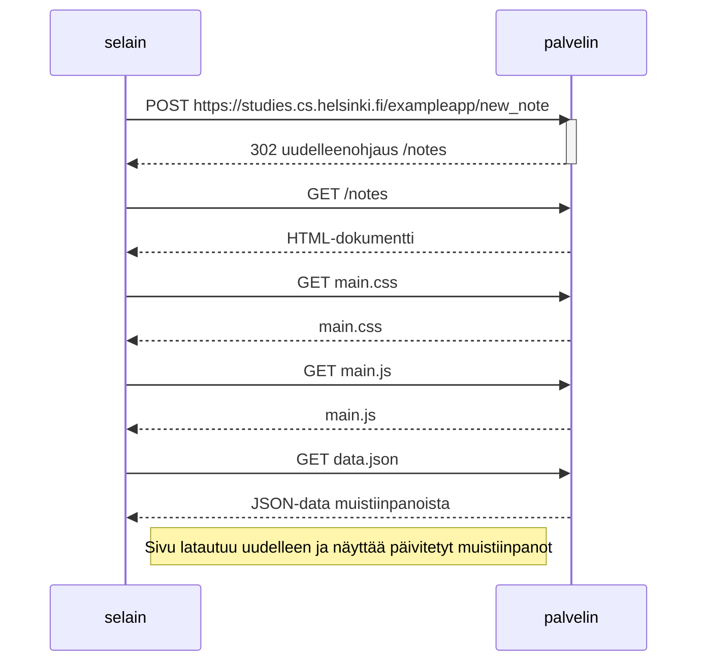

```mermaid
sequenceDiagram
    participant selain
    participant palvelin

    selain->>palvelin: POST https://studies.cs.helsinki.fi/exampleapp/new_note
    activate palvelin
    palvelin-->>selain: 302 uudelleenohjaus /notes
    deactivate palvelin

    selain->>palvelin: GET /notes
    palvelin-->>selain: HTML-dokumentti

    selain->>palvelin: GET main.css
    palvelin-->>selain: main.css

    selain->>palvelin: GET main.js
    palvelin-->>selain: main.js

    selain->>palvelin: GET data.json
    palvelin-->>selain: JSON-data muistiinpanoista

    Note right of selain: Sivu latautuu uudelleen ja näyttää päivitetyt muistiinpanot
```
