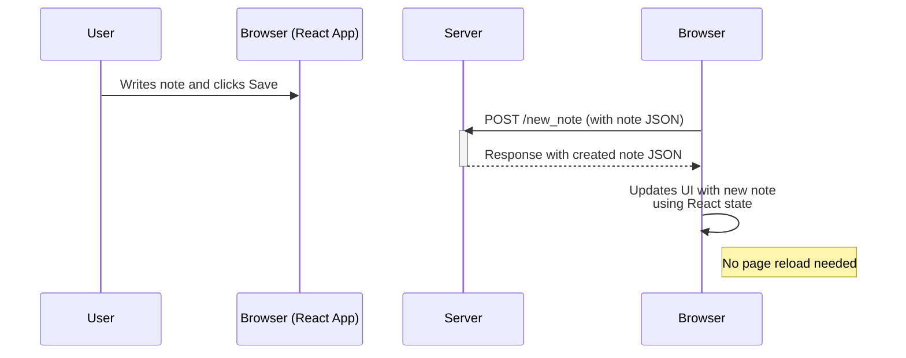

```mermaid
sequenceDiagram
    participant User
    participant Browser (React App)
    participant Server

    User->>Browser (React App): Writes note and clicks Save
    Browser->>Server: POST /new_note (with note JSON)
    activate Server
    Server-->>Browser: Response with created note JSON
    deactivate Server

    Browser->>Browser: Updates UI with new note<br>using React state
    Note right of Browser: No page reload needed
```
